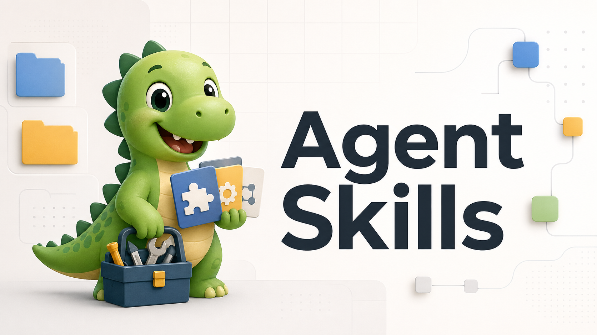

# Agent Skills

A collection of reusable skills for AI coding agents. Skills are packaged instructions and helper scripts that extend agent capabilities while keeping the workflow repository-friendly.



## Available Skills

### handoff-memory

Agent-neutral workflow for creating and maintaining shared repo-local, workspace-wide, or workstream-specific HANDOFF and memory documents.

**Use when:**
- Writing a project handoff before ending a session
- Writing a workspace handoff from a parent folder that coordinates multiple repos
- Resuming work from an existing handoff
- Standardizing shared project-state notes in Git-trackable files
- Keeping mutable handoff state out of `.codex`, `.claude`, `.windsurf`, or `.agents`

**Behavior:**
- Reuses an existing shared handoff file such as `docs/HANDOFF.md`, `memories/HANDOFF.md`, or `HANDOFF.md`
- Defaults to `docs/HANDOFF.md` for a repo and `_memory/HANDOFF.md` for a workspace
- Supports workstream-specific workspace documents under `_memory/workstreams/<name>/`
- Adds helper scripts for create, validate, and staleness checks
- Supports optional timestamped snapshots with explicit kind/reason metadata under `docs/handoffs/` or `_memory/handoffs/`
- Supports global or project-local skill installation, while keeping the shared data inside the repository or workspace root

### github-pr-review

Agent-neutral workflow for reviewing GitHub pull requests with `gh`, local `git`, tests, and GitHub APIs, then posting review comments as the authenticated GitHub account.

**Use when:**
- Setting up OAuth or GitHub CLI authentication for PR reviews
- Reviewing a PR URL, `owner/repo#123`, or the current branch PR
- Leaving review comments as the user's GitHub account
- Reviewing public or private repository PRs
- Collecting PR diff, checks, and related code context before drafting feedback

**Behavior:**
- Checks `gh auth status` and confirms the posting account without exposing tokens
- Supports PR URLs, `owner/repo#123`, PR numbers, branches, and current-branch PR lookup
- Separates public read access from authenticated review posting
- Explains private repo failures such as missing access, org SSO, or insufficient scopes
- Drafts findings first and posts only after confirmation unless immediate posting was requested
- Uses explicit-only `approve` and `request-changes` events

## Installation

Install from this collection interactively:

```bash
npx skills add https://github.com/17-sss/agent-skills
```

The CLI will inspect the repository, show the available skills, and guide you through the install flow.

Install a specific skill directly:

```bash
npx skills add https://github.com/17-sss/agent-skills --skill <skill-name>
```

Example:

```bash
npx skills add https://github.com/17-sss/agent-skills --skill handoff-memory
```

## Usage

Once installed, agents can invoke the relevant skill when a task matches it. Detailed usage, install scope, and workflow notes live inside each skill package under `skills/<skill-name>/README.md`.

## Repository Structure

Each skill lives under `skills/<skill-name>/` and may contain:

- `SKILL.md` - Primary skill definition
- `README.md` - Human-facing documentation
- `AGENTS.md` - Agent-facing repo guidance for the skill package
- `metadata.json` - Catalog metadata
- `scripts/` - Helper scripts
- `references/` - Supporting docs and templates
- `agents/` - Optional agent-specific metadata such as `openai.yaml`
