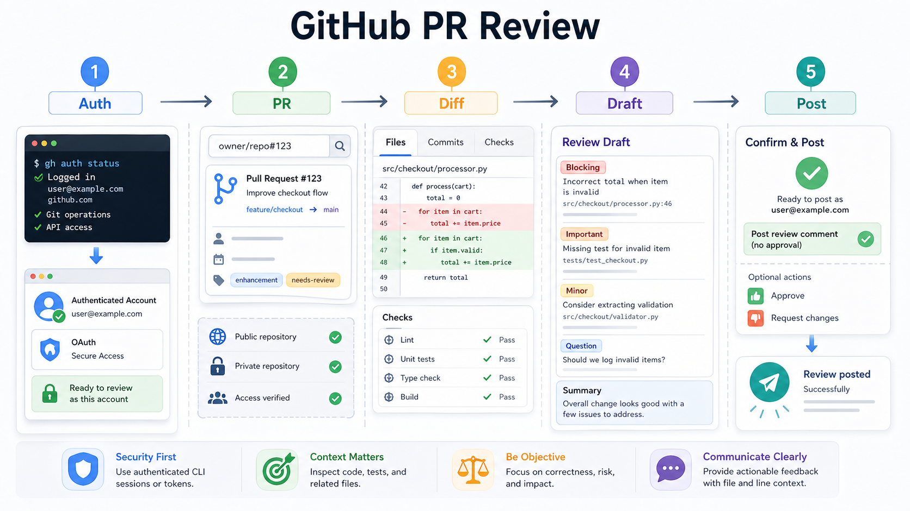

# github-pr-review

Agent-neutral workflow for reviewing GitHub pull requests with `gh`, local `git`, tests, and GitHub APIs, then posting summary or inline review comments as the authenticated GitHub account.

## Requirements

- GitHub CLI `gh`
- Local `git`
- A logged-in GitHub CLI session for private repos or review posting

## Workflow Highlights

- Checks `gh auth status` and identifies the account that will post reviews
- Collects PR metadata, diff, changed files, checks, and related local code context
- Drafts findings before posting unless immediate posting was explicitly requested
- Posts summary reviews with `gh pr review`
- Posts reliable inline multi-comment reviews with JSON payloads and `gh api --input`
- Verifies posted reviews with response `id`, `state`, and `html_url`

## Package Layout

- `SKILL.md` - Main workflow, review criteria, authentication policy, inline mapping, and posting policy
- `scripts/collect_pr_context.sh` - Collect PR metadata, diff, checks, and sanitized account context
- `scripts/post_review.sh` - Post a confirmed summary review with `gh pr review`
- `references/agent-adapters.md` - Short notes for Codex, Claude Code, Cursor, and generic agents
- `agents/openai.yaml` - Codex Skills UI metadata only

Use `SKILL.md` as the source of truth for behavior.
